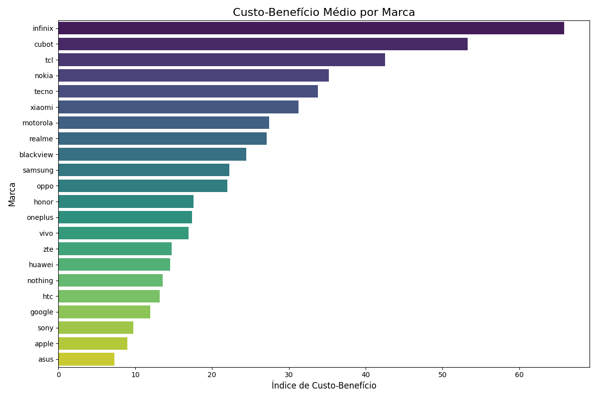
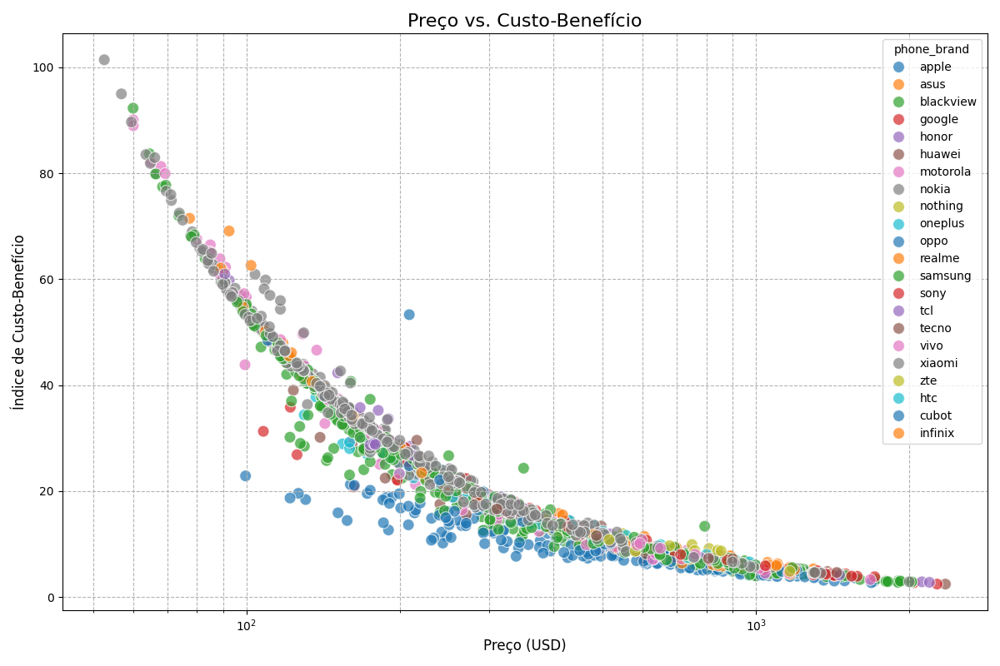
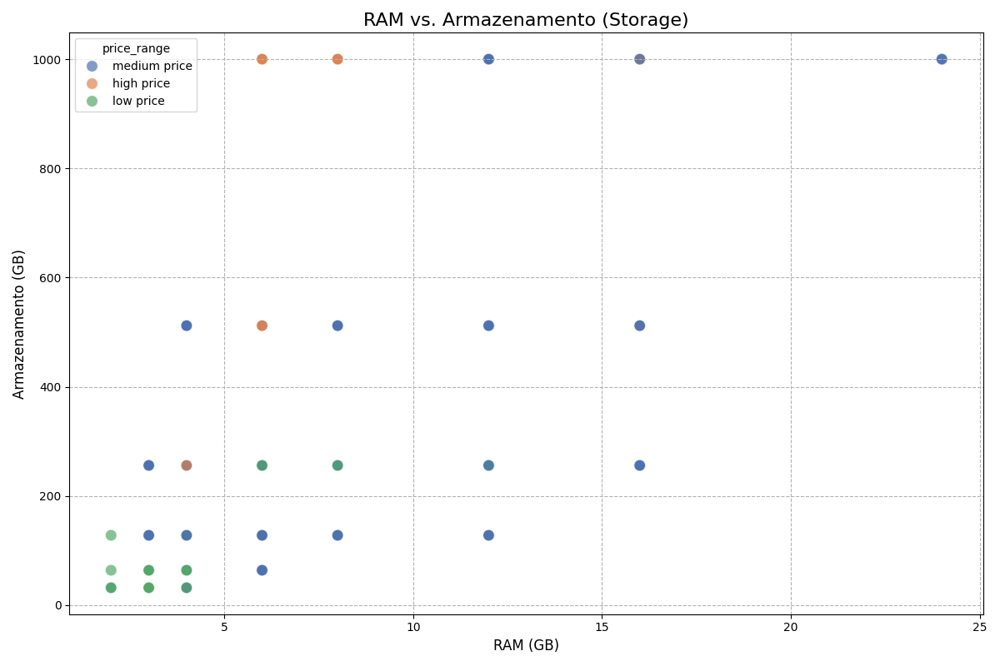
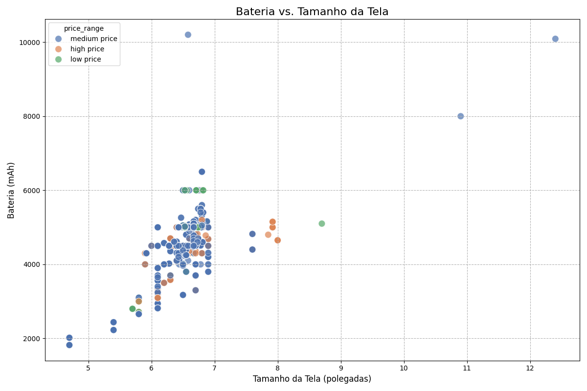
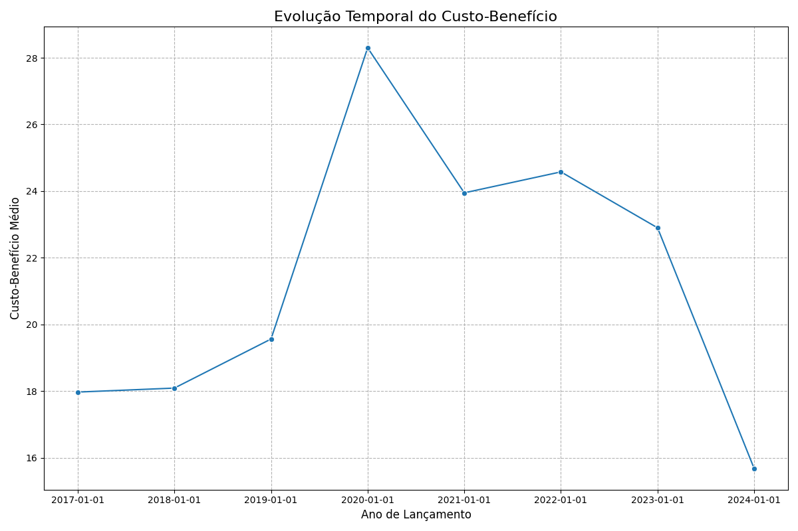
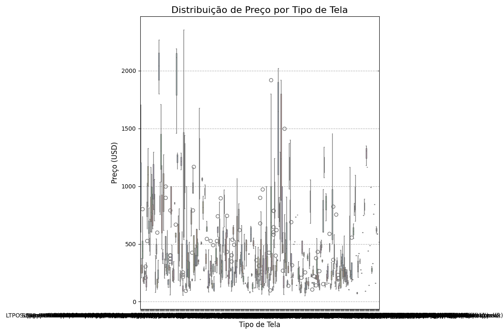
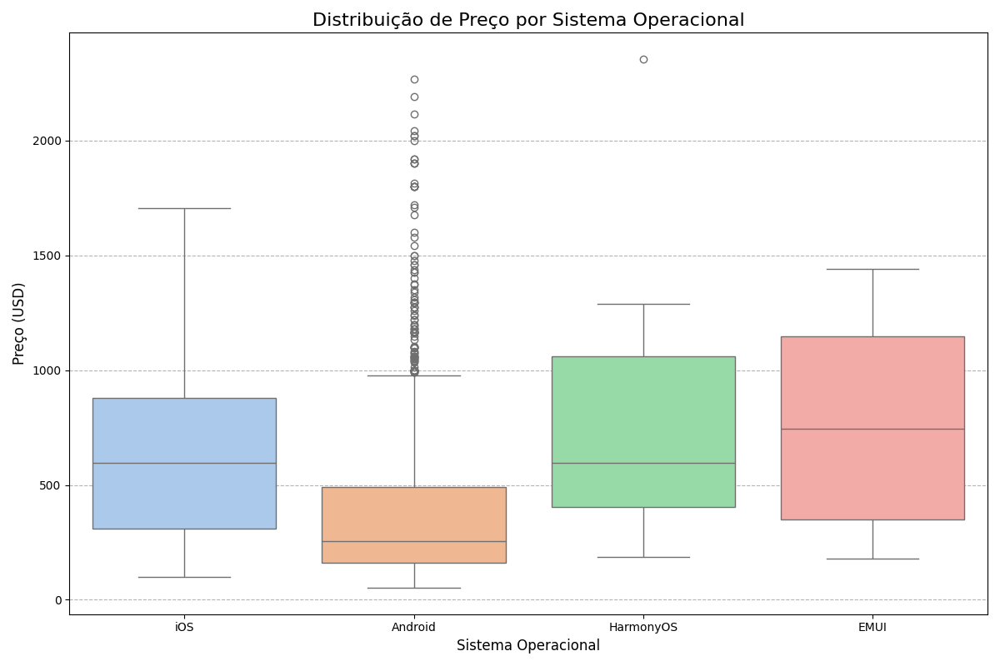
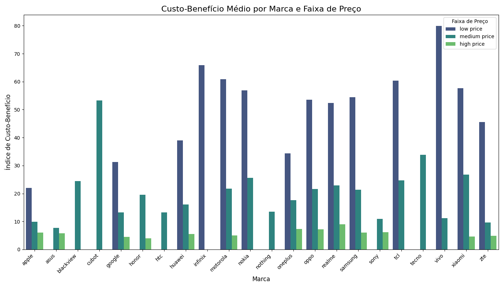

## Visão Geral do Projeto

Este projeto apresenta um dashboard interativo de Business Intelligence para análise comparativa de smartphones, focado na relação custo-benefício.

O objetivo é transformar dados técnicos complexos e preços em insights acionáveis e de fácil compreensão para consumidores e profissionais do mercado.

<!-- end_slide -->

Tecnologias Utilizadas
---

<!-- column_layout: [2, 3] -->

<!-- column: 0 -->

O projeto foi desenvolvido utilizando tecnologias de código aberto:

* **Python:** Linguagem de programação principal.
* **Pandas:** Para manipulação e análise de dados.
* **Streamlit:** Para a criação do dashboard interativo.
* **Altair:** Para a geração da maioria dos gráficos interativos.

<!-- column: 1 -->

```python
# pyproject.toml
[tool.poetry.dependencies]
python = "^3.11"
pandas = "^2.2.2"
streamlit = "^1.35.0"
altair = "^5.3.0"
```

<!-- reset_layout -->

<!-- end_slide -->

Problema
---

O mercado de smartphones é saturado de opções, tornando a escolha do aparelho ideal uma tarefa complexa.

* **Consumidores:** Dificuldade em comparar especificações técnicas e encontrar o melhor valor pelo dinheiro.
* **Varejistas:** Desafio em identificar tendências de mercado e otimizar o portfólio de produtos.

<!-- end_slide -->

Solução
---

Um dashboard interativo desenvolvido com Streamlit que serve como um "consultor virtual".

Ele permite aos usuários:
* Filtrar smartphones por marca, preço, ano e especificações.
* Visualizar e comparar aparelhos através de gráficos interativos.
* Identificar rapidamente os modelos com o melhor custo-benefício.

<!-- pause -->

```python
# app.py
import streamlit as st
import pandas as pd
import altair as alt

st.title('Smartphone Custo-Benefício Dashboard')

# ... (código do dashboard)
```

<!-- end_slide -->

Diagnóstico dos Processos
---

Nesta etapa, realizamos uma análise aprofundada dos processos críticos envolvidos na decisão de compra de smartphones e na gestão de produtos no varejo.

*   **Processo do Consumidor:** A jornada de compra é frequentemente manual e confusa, baseada em múltiplas abas de navegador, reviews subjetivos e especificações técnicas de difícil comparação.
*   **Processo do Varejista:** A seleção de portfólio de produtos muitas vezes depende de dados de vendas históricos, com dificuldade em antecipar tendências de custo-benefício e em identificar "heróis de vendas" em potencial.

<!-- end_slide -->

Proposição de Indicadores (KPIs)
---

Foram definidos KPIs específicos para monitorar e avaliar a eficácia das decisões e processos.

*   **KPI Primário (Core KPI):** O "Índice de Custo-Benefício" é o indicador central, usado para medir e comparar o valor intrínseco de cada smartphone.
*   **KPIs para Varejistas:**
    *   **Share de Custo-Benefício por Marca:** Percentual de aparelhos de uma marca que estão acima da média de custo-benefício do mercado.
    *   **Taxa de Adoção de Novos Modelos:** Velocidade com que novos modelos de alto custo-benefício são identificados e promovidos.
*   **KPIs para Consumidores:**
    *   **Tempo para Decisão:** Redução no tempo médio que um usuário leva para selecionar um smartphone usando o dashboard.
    *   **Índice de Confiança na Compra:** Medido através de pesquisas de satisfação pós-uso da ferramenta.

<!-- end_slide -->

Aplicação do Balanced Scorecard (BSC)
---

O Balanced Scorecard (BSC) foi utilizado como uma ferramenta estratégica para alinhar as ações do projeto com os objetivos de negócio mais amplos.

*   **Perspectivas do BSC:**
    *   **Financeira:** O dashboard contribui para a identificação de smartphones com melhor custo-benefício, otimizando o investimento e o retorno financeiro para consumidores e varejistas.
    *   **Cliente:** Fornece aos consumidores uma ferramenta clara e objetiva para a decisão de compra, aumentando a satisfação e a lealdade.
    *   **Processos Internos:** Melhora o processo de análise de mercado e seleção de produtos para varejistas, tornando-o mais eficiente e baseado em dados.
    *   **Aprendizado e Crescimento:** A plataforma pode ser continuamente atualizada com novos dados e funcionalidades, promovendo a inovação e o aprimoramento da análise.

<!-- end_slide -->

Análise e Plano de Ação
---

Com base nos dados e nos resultados simulados, foram desenvolvidos planos de ação estratégicos.

*   **Análise de Oportunidades:** Com base no gráfico "Preço vs. Custo-Benefício", identificamos smartphones que estão no quadrante "alta performance, baixo custo" como oportunidades de compra para consumidores e de destaque para varejistas.
*   **Identificação de Gargalos de Mercado:** O dashboard revela marcas com baixo custo-benefício, indicando um gargalo em sua estratégia de precificação ou na qualidade de seus produtos.
*   **Plano de Ação para Varejistas:** Utilizar o filtro por faixa de preço e o gráfico "Custo-Benefício por Marca" para otimizar o portfólio, focando em marcas e modelos que oferecem maior valor em cada segmento.
*   **Plano de Ação para Consumidores:** Navegar pela "Evolução Temporal do Custo-Benefício" para decidir se a compra de um modelo do ano anterior oferece uma vantagem financeira significativa.

<!-- end_slide -->

Features principais
---

O dashboard oferece uma variedade de filtros e visualizações:

* **Filtros:** Marca, faixa de preço, ano, tipo de tela, NFC, etc.
* **Métricas:** Preço médio, custo-benefício médio.
* **Gráficos:**
    * Custo-benefício por marca.
    * Preço vs. Custo-benefício.
    * RAM vs. Armazenamento.
    * Bateria vs. Tamanho da tela.
    * Evolução temporal do custo-benefício.

<!-- end_slide -->

Índice de Custo-Benefício
---

O núcleo da análise é o "Índice de Custo-Benefício", uma métrica que resume a performance de um smartphone em relação ao seu preço.

```python
# Fórmula do Índice de Custo-Benefício
cost_benefit_index = (ram + storage + battery + ppi_density) / price_usd
```

<!-- pause -->

Essa métrica permite uma comparação justa e objetiva entre diferentes modelos e marcas.

<!-- end_slide -->

Estrutura do Dashboard e KPIs
---

A estrutura do dashboard foi projetada para refletir diretamente os KPIs e objetivos de análise definidos no projeto.

*   **Análise do KPI Principal:** O "Índice de Custo-Benefício" é a estrela, presente em múltiplos gráficos para comparar marcas e modelos.
*   **Segmentação Estratégica:** Os filtros e gráficos permitem a segmentação por faixa de preço, marca e ano, conforme planejado, para análises de nicho.
*   **Análise de Correlação:**
    *   **Preço vs. Specs:** O gráfico "Preço vs. Custo-Benefício" aborda diretamente esta questão.
    *   **Specs vs. Specs:** Gráficos como "RAM vs. Armazenamento" revelam os trade-offs de hardware.
    *   **Marca vs. Custo-Benefício:** O gráfico de barras por marca e o detalhado por segmento respondem a esta pergunta.

<!-- end_slide -->

Visualizações do Dashboard
---

O dashboard dá vida aos dados com uma variedade de gráficos interativos, permitindo uma exploração profunda do mercado de smartphones. As seções a seguir detalham cada uma das principais análises visuais.

<!-- end_slide -->

Custo-Benefício Médio por Marca
---

Este gráfico de barras classifica as marcas com base no seu "Índice de Custo-Benefício" médio.



<!-- end_slide -->
*   **O que ele mostra:** Compara diretamente o valor que cada marca oferece em relação ao custo de seus aparelhos.
*   **Insights:**
    *   Identificar rapidamente quais marcas lideram o mercado em termos de custo-benefício.
    *   Descobrir marcas menos conhecidas que podem oferecer um valor excepcional.
    *   Avaliar se marcas premium justificam seu preço com um benefício proporcional.

<!-- end_slide -->

Preço vs. Custo-Benefício
---

Um gráfico de dispersão que posiciona cada smartphone com base em seu preço e no seu índice de custo-benefício.



<!-- end_slide -->
*   **O que ele mostra:** A relação entre o que você paga e o que você recebe. O ideal é estar no quadrante superior esquerdo (baixo custo, alto benefício).
*   **Insights:**
    *   Encontrar "joias escondidas": aparelhos com alto desempenho e preço competitivo.
    *   Visualizar quais smartphones estão com preços excessivos para o que oferecem.
    *   Entender a estratégia de precificação de diferentes marcas.

<!-- end_slide -->

Análise de Hardware
---

Dois gráficos de dispersão que exploram a relação entre componentes-chave:

1.  **RAM vs. Armazenamento:** Mostra como a memória RAM e o armazenamento interno se correlacionam.
2.  **Bateria vs. Tamanho da Tela:** Revela se telas maiores geralmente vêm com baterias maiores.


<!-- end_slide -->


<!-- end_slide -->
*   **Insights:**
    *   Analisar os padrões de combinação de hardware das fabricantes.
    *   Identificar se um aparelho economiza em uma especificação para melhorar outra.
    *   Verificar se um smartphone atende a um equilíbrio específico de hardware desejado (ex: muita RAM com armazenamento moderado).

<!-- end_slide -->

Evolução Temporal do Custo-Benefício
---

Este gráfico de linha acompanha o "Índice de Custo-Benefício" médio dos smartphones ao longo dos anos.



<!-- end_slide -->
*   **O que ele mostra:** A tendência da indústria: os celulares estão oferecendo mais por menos com o passar do tempo?
*   **Insights:**
    *   Observar o impacto da inovação tecnológica no valor oferecido ao consumidor.
    *   Identificar anos específicos em que houve um salto significativo no custo-benefício.
    *   Analisar se a tendência de melhoria de valor se aplica a todas as faixas de preço.

<!-- end_slide -->

Distribuição de Preço Categórica
---

Box plots que analisam a faixa de preços para diferentes categorias de hardware e software.

1.  **Tipo de Tela:** Compara os preços de aparelhos com telas OLED, IPS, etc.
2.  **Sistema Operacional:** Mostra a diferença de preço entre smartphones Android e iOS.


<!-- end_slide -->


<!-- end_slide -->
*   **Insights:**
    *   Entender o impacto de uma tecnologia específica (como tela OLED) no preço final do produto.
    *   Visualizar a dispersão de preços dentro de cada categoria.
    *   Comparar as estratégias de mercado para diferentes sistemas operacionais.

<!-- end_slide -->

Custo-Benefício por Marca e Segmento
---

Um gráfico de barras agrupadas que detalha o custo-benefício médio de cada marca dentro de diferentes faixas de preço (baixo, médio, alto).




<!-- end_slide -->
*   **O que ele mostra:** O desempenho de cada marca em seu nicho de mercado específico.
*   **Insights:**
    *   Descobrir qual marca domina o segmento de aparelhos de baixo custo.
    *   Avaliar se uma marca de luxo também compete bem em faixas de preço mais baixas.
    *   Fornecer uma visão granular para decisões de compra ou análise de concorrência.

<!-- end_slide -->

Conclusão
---

Este projeto transforma uma massa de dados complexos em uma ferramenta de decisão clara e poderosa.

Através de visualizações interativas e uma métrica de custo-benefício bem definida, o dashboard capacita **consumidores** a fazerem compras mais inteligentes e **profissionais** a entenderem as dinâmicas do mercado de smartphones com maior profundidade.
